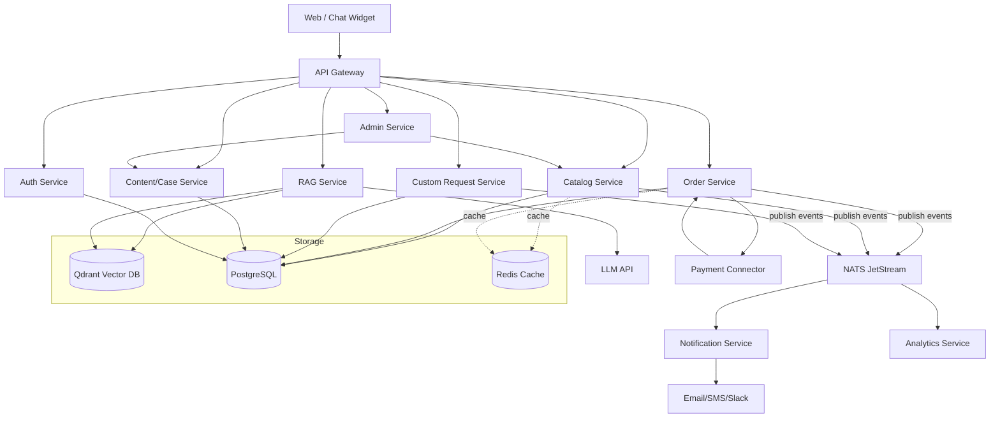

# Green — Backend Architecture (MVP) gitlab

Green — B2B-платформа для автоматизации бизнес-процессов. Эта архитектура описывает микросервисный backend на Go, оптимизированный под быстрый запуск MVP (6–8 недель) и последующую масштабируемость.

---

## Цели MVP

* Запуск маркетплейса: каталог (5–10 карточек) + оформление заказов.
* Бриф-форма для кастомных решений.
* Чат-виджет RAG-консультанта (2–3 варианта решений).
* Раздел кейсов/отзывов.
* Простая админ-панель.
* Достичь первых 20–30 клиентов в 3 месяца.

---

## Архитектура (схема взаимодействия сервисов)

---

## Основные микросервисы

* **Auth Service** — аутентификация, авторизация (JWT, RBAC).
* **Catalog Service** — карточки решений (цена, ROI, сроки).
* **Order Service** — заказы, статусы, оплата.
* **Custom Request Service** — заявки на кастомные проекты.
* **RAG Service** — консультант (retrieval → LLM → варианты решений).
* **Content/Case Service** — кейсы, отзывы, блог.
* **Admin Service** — управление контентом и заказами.
* **Notification Service** — уведомления (email/webhooks).
* **Payment Connector** — интеграция со Stripe (MVP).
* **Analytics Service** — сбор событий, базовая аналитика.

---

## Хранилища

* **PostgreSQL** — основное хранилище.
* **Redis** — кеш и rate limiting.
* **Qdrant** — векторное хранилище для RAG.
* **NATS JetStream** — шина событий и фоновые задачи.

---

## Observability

* **OpenTelemetry** → Prometheus + Grafana (метрики)
* **Jaeger** (tracing)
* **Zap** (structured logging)

---

## Поток данных (пример: заказ)

1. Клиент создаёт заказ → API Gateway → Order Service.
2. Order Service сохраняет заказ в Postgres и публикует событие `order.created` в NATS.
3. Notification Service получает событие и отправляет письмо пользователю.
4. Payment Connector получает webhook от Stripe → обновляет статус заказа → публикует событие `order.paid`.
5. Analytics Service агрегирует данные для отчётности.

---

## MVP Roadmap

1. **Catalog + Orders + Auth**
2. **Payment integration (Stripe sandbox)**
3. **RAG Service (OpenAI + Qdrant)**
4. **Content/Case Service + Admin**
5. **Notifications + базовая аналитика**

---
